# One-Shard Jetton Transfer Performance Diagram

This is the stage model for the one-shard jTPS investigation. The completion point for one successful jetton transfer is **TX3**, when the recipient jetton wallet commits the increased balance.

```mermaid
flowchart TB
    subgraph CLIENT["Off-chain wallet application"]
        A0["S0: Read or cache blockchain data<br/>TON-wallet seqno, addresses, fees"]
        A1["S1: Build jetton transfer body<br/>amount, destination owner, response address,<br/>forward TON amount, payload"]
        A2["S2: Build internal message<br/>user TON wallet -> sender jetton wallet<br/>op::transfer + attached TON"]
        A3["S3: Build and sign external message<br/>dest = user TON wallet<br/>seqno + valid_until + signature<br/>serialize as BOC"]
        A0 --> A1 --> A2 --> A3
    end

    subgraph INGRESS["Node ingress"]
        B0["S4: liteServer.sendMessage<br/>receive request and BOC"]
        B1["S5: External-message admission<br/>size/depth/TL-B validation<br/>resolve shard state and account<br/>run wallet TVM until ACCEPT<br/>signature, seqno and expiry checks"]
        B2["S6: Validator-local external mempool<br/>deduplication, per-address limits,<br/>priority and expiration"]
        B3["Broadcast external message<br/>to other validator nodes"]
        A3 --> B0 --> B1 --> B2
        B2 -.-> B3
    end

    subgraph COLLATOR["One-shard collator"]
        C0["S7: Start block candidate<br/>load previous shard state and config<br/>clean queues and process older inbound messages"]
        C1["S8: Take external from collator queue<br/>check structure, duplicate and shard destination"]
        T1["TX1: User TON wallet<br/>verify signature, seqno and valid_until<br/>ACCEPT; increment seqno<br/>emit internal op::transfer"]
        D1["Commit TX1<br/>msg_import_ext in InMsgDescr<br/>register outgoing internal message"]
        G1{"Same-shard processing allowed?<br/>ordering OK, queues clear enough,<br/>block limits and timeout remain"}
        Q1["Enqueue internal message<br/>continue in a later block"]
        T2["TX2: Sender jetton wallet<br/>authenticate owner wallet<br/>check and debit jetton balance<br/>derive recipient wallet + StateInit<br/>emit internal_transfer"]
        D2["Commit TX2<br/>msg_import_imm / msg_export_imm<br/>StateInit usually travels in message"]
        G2{"Still eligible for<br/>same-block processing?"}
        Q2["Enqueue internal_transfer<br/>continue in a later block"]
        T3["TX3: Recipient jetton wallet<br/>deploy from StateInit if uninitialized<br/>verify sender jetton wallet<br/>credit recipient jetton balance"]
        DONE["JETTON TRANSFER COMPLETE<br/>recipient balance is committed"]
        OPT["Optional fan-out from TX3"]
        T4["TX4: Recipient owner contract<br/>transfer_notification<br/>when forward_ton_amount > 0"]
        T5["TX4 or TX5: Response contract<br/>excesses refund<br/>when response address and TON remain"]
        FIN["S9: Finalize candidate<br/>account blocks and new shard state<br/>InMsgDescr / OutMsgDescr<br/>Merkle updates and block serialization"]

        B2 --> C0 --> C1 --> T1 --> D1 --> G1
        G1 -- Yes --> T2
        G1 -- No --> Q1 -->|next block| T2
        T2 --> D2 --> G2
        G2 -- Yes --> T3
        G2 -- No --> Q2 -->|next block| T3
        T3 --> DONE
        T3 --> OPT
        OPT -->|optional| T4
        OPT -->|optional| T5
        DONE --> FIN
        T4 --> FIN
        T5 --> FIN
    end

    subgraph CONSENSUS["Validation and observation"]
        V0["S10: Candidate propagation<br/>validator verification and re-execution"]
        V1["S11: Shard block accepted"]
        V2["S12: Masterchain references shard block"]
        V3["S13: Client or indexer observes transfer"]
        FIN --> V0 --> V1 --> V2 --> V3
    end
```



Every `TX` box internally contains the same node pipeline:

```text
account lookup/unpack
  -> input-message parsing
  -> storage and credit phases
  -> TVM compute phase
  -> action phase and forwarding-fee calculation
  -> optional bounce phase
  -> transaction serialization
  -> block-limit accounting
  -> account-state commit
  -> registration of generated messages
```

## Measurement Definition

- Minimal benchmark transfer: TX1 + TX2 + TX3, or approximately **3 raw transactions per jTPS**.
- Full notification transfer: adds `transfer_notification`, excess refund, or both, producing **4-5 raw transactions per jTPS**.
- The external message is not a transaction. It causes TX1.
- The liteserver admission TVM execution is additional off-block work. The wallet contract runs during admission and again during collation.
- One shard removes cross-shard routing, but does not guarantee same-block completion. Ordering constraints, existing queues, block limits, deferral rules, and collator timeouts can make TX2 or TX3 spill into later blocks.
- The arrows show causality. The collator can create a batch of TX1 transactions before draining recursively generated internal messages.

The primary throughput metric is:

```text
jTPS = successful TX3 recipient-balance credits / measurement duration
```

Ingress acceptance rate, external TPS, and raw transaction TPS are supporting metrics, not substitutes for jTPS.

## Implementation Anchors

- `validator/impl/liteserver.cpp:554`
- `validator/impl/ext-message-checker.cpp:28`
- `validator/impl/collator.cpp:4167`
- `crypto/func/auto-tests/legacy_tests/wallet-v4/wallet-v4-code.fc:73`
- `crypto/func/auto-tests/legacy_tests/jetton-wallet/jetton-wallet.fc:52`
